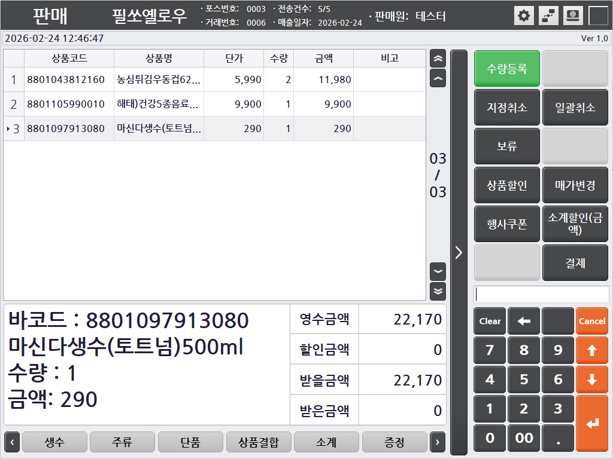
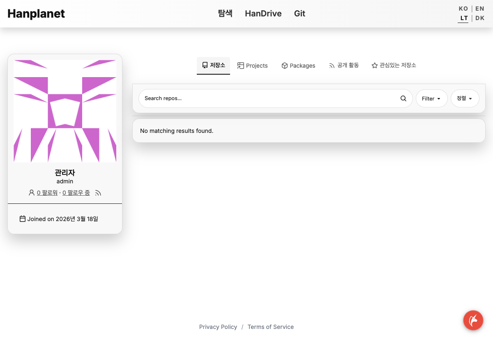
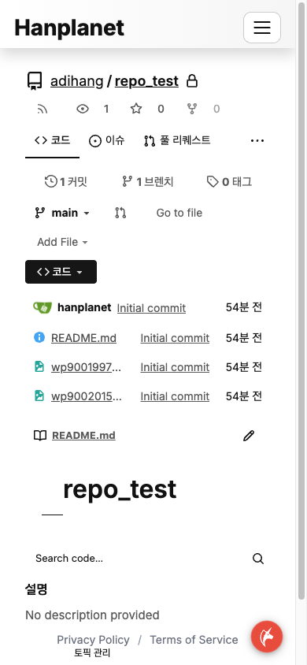
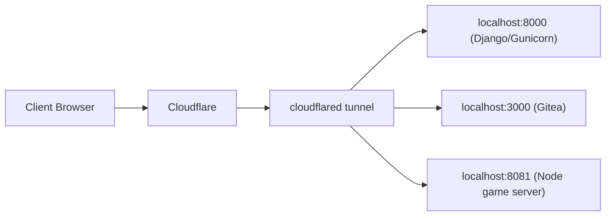
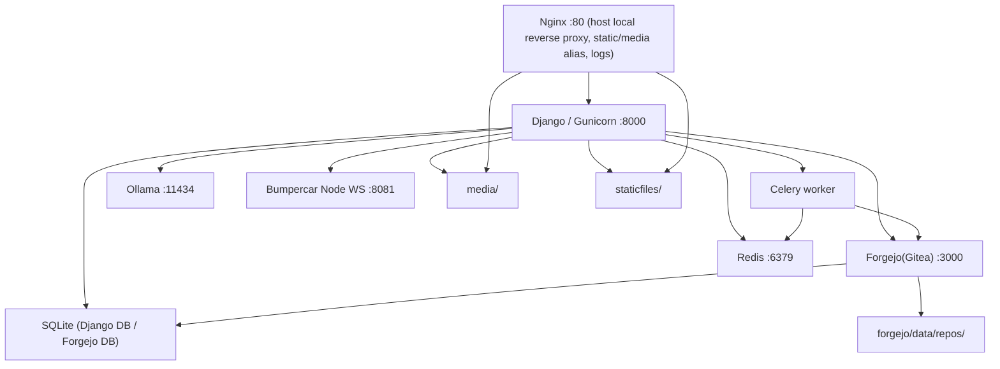

# Hanplanet

Hanplanet은 하나의 Django 프로젝트 안에 아래 기능을 함께 운영하는 통합 서비스입니다.

- 루트 탐색/검색 홈
- 포트폴리오/프로젝트 상세
- HanDrive 문서·파일 작업 공간
- HanDrive와 연결된 Git 저장소 관리
- Forgejo(Gitea) 기반 Git 웹 UI
- 실시간 멀티플레이어 게임 `Bumper Car Spiky`
- 미니게임 `Stratagem Hero`, `Salvation's Edge 4`
- Ollama 기반 AI 챗봇
- 접속 로그 수집/요약과 운영용 관리 화면

운영 기준 주소:

- 메인 서비스: [https://www.hanplanet.com](https://www.hanplanet.com)
- 루트 도메인: [https://hanplanet.com](https://hanplanet.com)
- Git 웹 UI: [https://git.hanplanet.com](https://git.hanplanet.com)
- 게임 WebSocket: `wss://game.hanplanet.com`

추가 운영 규칙과 에이전트용 상세 작업 규칙은 [PROJECT_GUIDELINES.md](./PROJECT_GUIDELINES.md)를 참고하세요.

## 대표 화면

아래 이미지는 현재 저장소에 같이 보관하는 대표 화면들입니다. 인증이 필요한 HanDrive 작업공간이나 운영자 화면은 UI가 자주 바뀌므로, README 자산은 대표 흐름 위주로 유지합니다.

### Portfolio / Project case



### Git user repository list



### Git repository detail



### Salvation's Edge 4 cover


## 서비스 전체 구조

### 1. 공개 트래픽 경로

현재 실제 운영 ingress는 Cloudflare Tunnel이 먼저 받고, 호스트 내부 포트로 직접 연결합니다.



현재 `~/.cloudflared/config.yml` 기준:

- `www.hanplanet.com`, `hanplanet.com` -> `http://localhost:8000`
- `git.hanplanet.com` -> `http://localhost:3000`
- `game.hanplanet.com` -> `http://localhost:8081`
- `ssh.hanplanet.com` -> `ssh://localhost:22`

### 2. 호스트 내부 서비스 구조



### 3. 서버별 역할

| 서버/서비스 | 역할 | 주요 설정 파일 |
| --- | --- | --- |
| Django + Gunicorn | 메인 웹, API, 템플릿 렌더링, HanDrive, 포트폴리오, 게임 토큰 발급 | [`config/settings.py`](./config/settings.py), [`config/urls.py`](./config/urls.py), [`main/views.py`](./main/views.py), [`main/handrive_views.py`](./main/handrive_views.py) |
| Forgejo / Gitea | Git 저장소 웹 UI, bare repo 저장소, OAuth/세션 기반 Git 웹 | [`forgejo/custom/conf/app.ini`](./forgejo/custom/conf/app.ini), [`forgejo/custom/templates/`](./forgejo/custom/templates/) |
| Celery worker | HanDrive -> Git 저장소 생성/재시도 같은 비동기 작업 | [`main/git_tasks.py`](./main/git_tasks.py), [`deploy/launchd/com.hanplanet.celery.plist`](./deploy/launchd/com.hanplanet.celery.plist) |
| Redis | Celery broker | launchd/brew services 환경 |
| Node game server | 실시간 범퍼카 월드 시뮬레이션, JWT 검증, WebSocket | [`bumpercar-spiky-server/server.js`](./bumpercar-spiky-server/server.js), [`bumpercar-spiky-server/world/world.js`](./bumpercar-spiky-server/world/world.js) |
| Ollama | `/api/chat/`의 LLM 백엔드 | [`config/settings.py`](./config/settings.py) |
| Nginx | host local reverse proxy, static/media alias, access log JSON | [`nginx/nginx.autorun.conf`](./nginx/nginx.autorun.conf), [`nginx/portfolio.conf`](./nginx/portfolio.conf) |
| Cloudflare Tunnel | 공개 도메인 -> 로컬 포트 라우팅 | `~/.cloudflared/config.yml` |

## 서버들은 어떻게 연동되는가

### HanDrive + Git 연동

1. 사용자가 HanDrive에서 폴더를 Git 저장소로 생성 요청
2. Django API가 `GitRepository` 레코드를 만들고 Celery 작업을 큐에 넣음
3. Celery가 Forgejo API를 호출해 저장소를 만들고 파일을 push
4. HanDrive는 이 저장소를 가상 폴더/브랜치 구조처럼 렌더링
5. 브랜치 내부 수정/업로드/이동/삭제는 temp clone -> commit -> push 경로로 처리

관련 코드:

- 요청/상태 API: [`main/views.py`](./main/views.py)
- Forgejo API client: [`main/forgejo_client.py`](./main/forgejo_client.py)
- 서비스 계층: [`main/git_service.py`](./main/git_service.py)
- Celery task: [`main/git_tasks.py`](./main/git_tasks.py)
- HanDrive 가상 Git 경로 처리: [`main/handrive_views.py`](./main/handrive_views.py)

### 게임 서버 연동

1. 브라우저가 범퍼카 페이지를 Django에서 렌더링
2. 클라이언트가 `/api/game-auth-token/`으로 JWT 요청
3. Django가 게임 전용 JWT 발급
4. 브라우저가 `wss://game.hanplanet.com`으로 WebSocket 연결
5. Node 게임 서버가 JWT를 검증하고 월드 시뮬레이션에 플레이어를 추가
6. 월드 상태를 msgpack/WebSocket으로 브라우저에 지속 전송

관련 코드:

- 게임 페이지/토큰 API: [`main/views.py`](./main/views.py)
- WS 서버: [`bumpercar-spiky-server/network/websocket.js`](./bumpercar-spiky-server/network/websocket.js)
- 게임 루프: [`bumpercar-spiky-server/game/gameLoop.js`](./bumpercar-spiky-server/game/gameLoop.js)
- 월드 판정: [`bumpercar-spiky-server/world/world.js`](./bumpercar-spiky-server/world/world.js)

### AI 챗봇 연동

1. 브라우저가 `/api/chat/` 호출
2. Django가 입력을 정리하고 Ollama HTTP API로 프록시
3. 응답을 HTML/markdown 안전 규칙에 맞춰 다시 반환

관련 코드:

- API: [`main/views.py`](./main/views.py)
- 위젯 UI: [`static/js/common/chat_widget.js`](./static/js/common/chat_widget.js)

## 기술 스택

### Backend

- Python
- Django 5
- SQLite
- Celery
- Redis
- django-celery-results
- django-cors-headers
- oauthlib / django-oauth-toolkit (`oauth2_provider`)
- Markdown
- Pillow
- LibreOffice headless (HanDrive 오피스 미리보기 변환)

### Frontend

- Django Templates
- Vanilla JavaScript
- Bootstrap vendor asset
- 공용 CSS + 페이지 전용 CSS 분리 구조
- Google Fonts (`Inter`, `Noto Sans KR`)

### Git / infra

- Forgejo/Gitea
- Cloudflare Tunnel
- Nginx
- macOS launchd

### Game

- Node.js
- `ws`
- `jsonwebtoken`
- `@msgpack/msgpack`

### AI / preview / ops

- Ollama
- LibreOffice
- JSON access logs + 일일 요약 command

## API 맵

전체 라우트 등록 위치는 [`main/urls.py`](./main/urls.py) 입니다. 아래는 기능별로 어디에 정의되어 있는지 정리한 표입니다.

### 공통/PWA/API

| 경로 | 용도 | 실제 처리 함수 |
| --- | --- | --- |
| `/manifest.webmanifest` | PWA manifest | [`main/views.py`](./main/views.py) `pwa_manifest` |
| `/service-worker.js` | service worker | [`main/views.py`](./main/views.py) `service_worker` |
| `/api/chat/` | Ollama 챗봇 | [`main/views.py`](./main/views.py) `chat_with_ai` |
| `/api/theme-preference/` | 테마 저장 | [`main/views.py`](./main/views.py) `theme_preference` |
| `/api/user-preferences/` | 사용자 선호 저장 | [`main/views.py`](./main/views.py) `user_preferences` |
| `/api/root-shortcuts/` | 루트 바로가기 CRUD | [`main/views.py`](./main/views.py) `root_shortcuts`, `root_shortcuts_detail`, `root_shortcuts_reorder` |
| `/account/profile-image/` | 프로필 이미지 업로드 | [`main/views.py`](./main/views.py) `account_profile_image_upload` |

### 게임 API

| 경로 | 용도 | 실제 처리 함수 |
| --- | --- | --- |
| `/api/game-auth-token/` | 게임 JWT 발급 | [`main/views.py`](./main/views.py) `game_auth_token` |
| `/api/internal/bumpercar-spiky/stats/` | 게임 통계 수집 | [`main/views.py`](./main/views.py) `bumpercar_spiky_stats_record` |
| `/fun/bumpercar-spiky/admin/` | 게임 관리자 화면 | [`main/views.py`](./main/views.py) `bumpercar_spiky_admin_page` |
| `/fun/bumpercar-spiky/restart-server/` | 게임 서버 재시작 | [`main/views.py`](./main/views.py) `bumpercar_spiky_restart_server` |
| `/fun/bumpercar-spiky/set-npc-health/` | NPC 체력 조정 | [`main/views.py`](./main/views.py) `bumpercar_spiky_set_npc_health` |

### HanDrive API

HanDrive 파일/권한/미리보기/공유 관련 요청은 대부분 [`main/handrive_views.py`](./main/handrive_views.py)에 있습니다.

| 경로 | 용도 |
| --- | --- |
| `/handrive/api/list` | 폴더 목록 |
| `/handrive/api/save` | 파일 저장 |
| `/handrive/api/preview` | 파일 미리보기 |
| `/handrive/api/rename` | 이름 변경 |
| `/handrive/api/delete` | 삭제 |
| `/handrive/api/mkdir` | 폴더 생성 |
| `/handrive/api/move` | 이동 |
| `/handrive/api/upload` | 업로드 |
| `/handrive/api/upload/cancel` | 업로드 취소 |
| `/handrive/api/download` | 다운로드 |
| `/handrive/api/acl` | 권한 설정 |
| `/handrive/api/acl-options` | 권한 설정 후보 조회 |
| `/handrive/api/url-share` | 링크 공유 |
| `/handrive/api/login-captcha-status` | 로그인 캡차 상태 |

### Git / Device Flow API

Git repo 생성/조회/협업자/clone URL/API와 device flow는 [`main/views.py`](./main/views.py)에 있습니다.

| 경로 | 용도 |
| --- | --- |
| `/api/git/repos/` | 저장소 생성 |
| `/api/git/repos/by-path/` | 경로로 저장소 조회 |
| `/api/git/repos/<id>/status/` | 작업 상태 조회 |
| `/api/git/repos/<id>/retry/` | 실패 작업 재시도 |
| `/api/git/repos/<id>/clone/` | clone URL 조회 |
| `/api/git/repos/<id>/collaborators/` | 협업자 추가 |
| `/api/git/auth/device/` | device code 발급 |
| `/api/git/auth/token/` | device flow polling |
| `/api/git/auth/approve/` | 승인 처리 |
| `/git-auth/` | 브라우저 승인 화면 |
| `/git-auth/credential-helper/` | Git credential helper 다운로드 |

### WebSocket / 실시간 프로토콜

HTTP URL이 아니라 Node 서버 내부 프로토콜로 정의된 부분:

- WebSocket 연결/메시지 처리: [`bumpercar-spiky-server/network/websocket.js`](./bumpercar-spiky-server/network/websocket.js)
- JWT 검증: [`bumpercar-spiky-server/auth/jwt.js`](./bumpercar-spiky-server/auth/jwt.js)

## 폴더 구조와 목적

### 최상위 폴더

| 경로 | 목적 |
| --- | --- |
| [`config/`](./config/) | Django settings, project URLConf, WSGI/ASGI, Celery bootstrap |
| [`main/`](./main/) | 메인 Django 앱. 모델, 뷰, Git 서비스, HanDrive 뷰, admin, management command |
| [`templates/`](./templates/) | Django 템플릿. 공통 partial, popup, handrive, portfolio, fun 페이지 템플릿 |
| [`static/`](./static/) | 소스 정적 파일. CSS/JS/아이콘/게임 자산 |
| [`staticfiles/`](./staticfiles/) | `collectstatic` 결과물. 직접 수정 금지 |
| [`media/`](./media/) | 업로드 파일, HanDrive 실제 파일, 포트폴리오 업로드 |
| [`forgejo/`](./forgejo/) | Gitea work path, custom templates/assets, data/log |
| [`bumpercar-spiky-server/`](./bumpercar-spiky-server/) | 별도 Node 게임 서버 |
| [`deploy/`](./deploy/) | launchd plist, helper script |
| [`nginx/`](./nginx/) | nginx 설정 |
| [`scripts/`](./scripts/) | access log rotate/summary 등 운영 스크립트 |
| [`docs/readme-assets/`](./docs/readme-assets/) | README에서 참조하는 이미지 자산 |

### `main/` 핵심 파일

| 파일 | 목적 |
| --- | --- |
| [`main/views.py`](./main/views.py) | 루트/포트폴리오/게임/API/Git/device flow/PWA 등 메인 뷰 |
| [`main/handrive_views.py`](./main/handrive_views.py) | HanDrive 파일 브라우저, 편집기, ACL, Git virtual path 처리 |
| [`main/handrive/preview.py`](./main/handrive/preview.py) | PDF/HTML/LibreOffice 기반 미리보기 helper |
| [`main/handrive/html_assets.py`](./main/handrive/html_assets.py) | HTML companion asset 로더 |
| [`main/models.py`](./main/models.py) | 포트폴리오, HanDrive ACL, quick link, user profile, Git model |
| [`main/forgejo_client.py`](./main/forgejo_client.py) | Forgejo/Gitea REST 호출 |
| [`main/git_service.py`](./main/git_service.py) | Git repo 생성/상태 추상화 |
| [`main/git_tasks.py`](./main/git_tasks.py) | Celery에서 실행되는 Git 작업 |
| [`main/middleware.py`](./main/middleware.py) | 글로벌 rate limit middleware |
| [`main/access_log_scheduler.py`](./main/access_log_scheduler.py) | 접속 로그 요약 scheduler |
| [`main/access_log_summary.py`](./main/access_log_summary.py) | access log summary helper |
| [`main/management/commands/summarize_access_logs.py`](./main/management/commands/summarize_access_logs.py) | 일일 로그 요약 command |

### `static/js/` 구조

| 경로 | 목적 |
| --- | --- |
| [`static/js/common/`](./static/js/common/) | 사이트 전역 JS. nav, popup, chat widget, print helper 등 |
| [`static/js/pages/`](./static/js/pages/) | 특정 Django page 전용 엔트리 |
| [`static/js/handrive/`](./static/js/handrive/) | Handrive 전용 모듈. list, preview, queue, modal, git repo UI |
| [`static/js/fun/`](./static/js/fun/) | 게임/미니게임 전용 JS |
| [`static/js/vendor/`](./static/js/vendor/) | 직접 수정하지 않는 vendor asset |

### `static/css/` 구조

| 경로 | 목적 |
| --- | --- |
| [`static/css/common/`](./static/css/common/) | 공용 레이아웃, 공통 팝업, 계정 위젯, 채팅 위젯 |
| [`static/css/pages/`](./static/css/pages/) | 페이지 전용 스타일 |
| [`static/css/fun/`](./static/css/fun/) | 게임/미니게임 전용 스타일 |
| [`static/css/vendor/`](./static/css/vendor/) | vendor CSS |

### `templates/` 구조

| 경로 | 목적 |
| --- | --- |
| [`templates/base.html`](./templates/base.html) | 공통 베이스 템플릿 |
| [`templates/none.html`](./templates/none.html) | 루트 탐색/검색 홈 |
| [`templates/main/`](./templates/main/) | 포트폴리오와 프로젝트 상세 |
| [`templates/handrive/`](./templates/handrive/) | HanDrive 화면 |
| [`templates/fun/`](./templates/fun/) | 범퍼카/Stratagem/Salvation's Edge |
| [`templates/partials/`](./templates/partials/) | 공통 재사용 파셜 |
| [`templates/popup/`](./templates/popup/) | 팝업/모달 전용 템플릿 |

### `forgejo/` 구조

| 경로 | 목적 |
| --- | --- |
| [`forgejo/custom/conf/app.ini`](./forgejo/custom/conf/app.ini) | Gitea 설정 |
| [`forgejo/custom/templates/`](./forgejo/custom/templates/) | Gitea 템플릿 오버라이드 |
| [`forgejo/custom/public/assets/`](./forgejo/custom/public/assets/) | Gitea가 쓰는 커스텀 CSS/JS/이미지 |
| `forgejo/data/repos/` | 실제 bare Git 저장소 |
| `forgejo/data/gitea.db` | Gitea SQLite DB |
| `forgejo/log/` | Gitea stdout/stderr 및 app 로그 |

### `bumpercar-spiky-server/` 구조

| 경로 | 목적 |
| --- | --- |
| [`server.js`](./bumpercar-spiky-server/server.js) | 진입점 |
| [`config/config.js`](./bumpercar-spiky-server/config/config.js) | 런타임 기본 설정 |
| [`config/gameplaySettings.js`](./bumpercar-spiky-server/config/gameplaySettings.js) | Django 공유 게임 설정 로더 |
| [`network/websocket.js`](./bumpercar-spiky-server/network/websocket.js) | WebSocket 연결/메시지 처리 |
| [`game/gameLoop.js`](./bumpercar-spiky-server/game/gameLoop.js) | fixed tick 루프 |
| [`world/world.js`](./bumpercar-spiky-server/world/world.js) | 월드 핵심 판정 |
| [`world/worldDeath.js`](./bumpercar-spiky-server/world/worldDeath.js) | 사망/리스폰 처리 |
| [`world/worldEncounter.js`](./bumpercar-spiky-server/world/worldEncounter.js) | encounter phase 처리 |
| [`world/player.js`](./bumpercar-spiky-server/world/player.js) | player/NPC 상태 구조 |

## 코드를 이해할 때 권장 읽기 순서

주석과 docstring을 읽으면서 들어가기 가장 편한 순서는 아래입니다.

### 전체 서비스 파악 순서

1. [`PROJECT_GUIDELINES.md`](./PROJECT_GUIDELINES.md)
2. [`README.md`](./README.md)
3. [`config/settings.py`](./config/settings.py)
4. [`config/urls.py`](./config/urls.py)
5. [`main/urls.py`](./main/urls.py)

### 포트폴리오 / 루트 홈

1. [`templates/base.html`](./templates/base.html)
2. [`templates/none.html`](./templates/none.html)
3. [`static/js/pages/none/root_search.js`](./static/js/pages/none/root_search.js)
4. [`main/views.py`](./main/views.py)

### HanDrive

1. [`templates/handrive/`](./templates/handrive/)
2. [`static/js/handrive/page.js`](./static/js/handrive/page.js)
3. [`static/js/handrive/preview_flow_helpers.js`](./static/js/handrive/preview_flow_helpers.js)
4. [`static/js/handrive/queue_operation_helpers.js`](./static/js/handrive/queue_operation_helpers.js)
5. [`main/handrive_views.py`](./main/handrive_views.py)
6. [`main/handrive/preview.py`](./main/handrive/preview.py)
7. [`main/handrive/html_assets.py`](./main/handrive/html_assets.py)

### Git 연동

1. [`main/views.py`](./main/views.py) 의 `git_*` API
2. [`main/forgejo_client.py`](./main/forgejo_client.py)
3. [`main/git_service.py`](./main/git_service.py)
4. [`main/git_tasks.py`](./main/git_tasks.py)
5. [`forgejo/custom/conf/app.ini`](./forgejo/custom/conf/app.ini)
6. [`forgejo/custom/templates/`](./forgejo/custom/templates/)

### 범퍼카 게임

1. [`templates/fun/Hanplanet_Multiplayer.html`](./templates/fun/Hanplanet_Multiplayer.html)
2. [`static/js/fun/bumpercar_spiky/multiplayer.js`](./static/js/fun/bumpercar_spiky/multiplayer.js)
3. [`main/views.py`](./main/views.py) 의 범퍼카 페이지/토큰 함수
4. [`bumpercar-spiky-server/README.md`](./bumpercar-spiky-server/README.md)
5. [`bumpercar-spiky-server/network/websocket.js`](./bumpercar-spiky-server/network/websocket.js)
6. [`bumpercar-spiky-server/world/world.js`](./bumpercar-spiky-server/world/world.js)

### 공용 UI / 위젯

1. [`static/js/common/site.js`](./static/js/common/site.js)
2. [`static/js/common/site_nav_responsive_manager.js`](./static/js/common/site_nav_responsive_manager.js)
3. [`static/js/common/popup_common.js`](./static/js/common/popup_common.js)
4. [`static/js/common/chat_widget.js`](./static/js/common/chat_widget.js)
5. [`static/css/common/`](./static/css/common/)

## 초기 세팅

### 1. 필수 도구

권장 환경:

- macOS
- Python 3.x
- Node.js + npm
- Homebrew

운영 또는 로컬 재현에 필요한 도구:

```bash
brew install nginx redis gitea libreoffice
```

선택:

- `ollama` - 챗봇 기능 테스트 시
- `cloudflared` - 공개 도메인/터널 재현 시

### 2. Python 환경

```bash
cd /Users/imhanbyeol/Development/Hanplanet
python3 -m venv .venv
source .venv/bin/activate
pip install -r requirements.txt
```

### 3. Django 초기화

```bash
cd /Users/imhanbyeol/Development/Hanplanet
.venv/bin/python manage.py migrate
.venv/bin/python manage.py collectstatic --noinput
.venv/bin/python manage.py createsuperuser
```

### 4. 시크릿 파일

`config/secrets.json`은 git에 올리지 않습니다.

예시:

```json
{
  "SECRET_KEY": "change-this-in-real-env",
  "FORGEJO_BASE_URL": "http://localhost:3000",
  "FORGEJO_ADMIN_TOKEN": "gitea-admin-api-token",
  "PUBLIC_GIT_BASE_URL": "https://git.hanplanet.com",
  "GAME_JWT_SECRET": "game-jwt-secret",
  "GAME_JWT_ISSUER": "https://www.hanplanet.com",
  "GAME_JWT_AUDIENCE": "hanplanet-game",
  "TURNSTILE_SITE_KEY": "",
  "TURNSTILE_SECRET_KEY": ""
}
```

권한:

```bash
chmod 600 config/secrets.json
```

### 5. 범퍼카 게임 서버 초기화

```bash
cd /Users/imhanbyeol/Development/Hanplanet/bumpercar-spiky-server
cp .env.example .env
npm install
```

`.env`에서 Django의 게임 JWT 값과 동일하게 맞춰야 하는 키:

- `JWT_SECRET`
- `JWT_ISSUER`
- `JWT_AUDIENCE`

### 6. Gitea / Git 기능 초기화

```bash
brew services start redis
cd /Users/imhanbyeol/Development/Hanplanet/forgejo
bash setup.sh
```

`setup.sh`가 출력한 토큰을 `config/secrets.json`의 `FORGEJO_ADMIN_TOKEN`으로 넣어야 HanDrive Git API가 정상 동작합니다.

### 7. 로컬 실행

```bash
# Django
cd /Users/imhanbyeol/Development/Hanplanet
.venv/bin/python manage.py runserver

# Game server
cd /Users/imhanbyeol/Development/Hanplanet/bumpercar-spiky-server
PORT=8081 node server.js
```

필요하면 Ollama도 별도로 올립니다.

```bash
ollama pull llama3.2:latest
ollama serve
```

## 운영 배포 / 재시작

### launchd 서비스

| 서비스 | 라벨 | plist |
| --- | --- | --- |
| Django/Gunicorn | `com.hanplanet.gunicorn` | `~/Library/LaunchAgents/` |
| Nginx | `com.hanplanet.nginx` | `~/Library/LaunchAgents/` |
| Gitea | `com.hanplanet.gitea` | [`deploy/launchd/com.hanplanet.gitea.plist`](./deploy/launchd/com.hanplanet.gitea.plist) |
| Celery | `com.hanplanet.celery` | [`deploy/launchd/com.hanplanet.celery.plist`](./deploy/launchd/com.hanplanet.celery.plist) |
| 범퍼카 게임 서버 | `com.hanplanet.bumpercar-spiky-server` | [`bumpercar-spiky-server/deploy/launchd/com.hanplanet.bumpercar-spiky-server.plist`](./bumpercar-spiky-server/deploy/launchd/com.hanplanet.bumpercar-spiky-server.plist) |

### 자주 쓰는 명령

```bash
# Django 변경
cd /Users/imhanbyeol/Development/Hanplanet
.venv/bin/python manage.py collectstatic --noinput
launchctl kickstart -k gui/$(id -u)/com.hanplanet.gunicorn

# Celery 변경
launchctl kickstart -k gui/$(id -u)/com.hanplanet.celery

# Gitea 변경
launchctl kickstart -k gui/$(id -u)/com.hanplanet.gitea

# 게임 서버 변경
launchctl kickstart -k gui/$(id -u)/com.hanplanet.bumpercar-spiky-server
```

### 로그

| 대상 | 위치 |
| --- | --- |
| Celery stdout | [`log/celery.stdout.log`](./log/celery.stdout.log) |
| Celery stderr | [`log/celery.stderr.log`](./log/celery.stderr.log) |
| 범퍼카 게임 stdout | `/tmp/bumpercar-spiky-server.log` |
| 범퍼카 게임 stderr | `/tmp/bumpercar-spiky-server-error.log` |
| Gitea logs | `forgejo/log/` |
| Nginx access JSON | `/opt/homebrew/var/log/nginx/access_json.log` |

## 운영 스크립트

| 파일 | 목적 |
| --- | --- |
| [`deploy/scripts/git-credential-hanplanet`](./deploy/scripts/git-credential-hanplanet) | Git credential helper. OAuth2 device flow로 Git clone/push 인증 |
| [`scripts/rotate-nginx-access-json.sh`](./scripts/rotate-nginx-access-json.sh) | access JSON log rotate 및 30일 보관 |
| [`scripts/summarize-nginx-access-json.sh`](./scripts/summarize-nginx-access-json.sh) | 일일 access log summary 생성 |

## 이 프로젝트에서 주의할 점

- `staticfiles/`는 결과물이라 직접 수정하지 않습니다.
- CSS/JS 또는 이를 참조하는 템플릿을 바꾸면 항상 `collectstatic` 후 gunicorn 재시작이 필요합니다.
- HanDrive Git 기능은 Django + Celery + Redis + Forgejo 네 요소가 모두 살아 있어야 정상 동작합니다.
- 범퍼카 게임은 Django만 살아 있어도 안 되고, Node 게임 서버와 JWT 설정이 같이 맞아야 합니다.
- Forgejo custom asset은 [`forgejo/custom/public/assets/`](./forgejo/custom/public/assets/) 아래에서 관리합니다.
- Office 미리보기는 LibreOffice가 설치되어 있어야 품질이 제대로 나옵니다.

## 같이 보면 좋은 문서

- [PROJECT_GUIDELINES.md](./PROJECT_GUIDELINES.md)
- [DEPLOYMENT.md](./DEPLOYMENT.md)
- [bumpercar-spiky-server/README.md](./bumpercar-spiky-server/README.md)
- [AGENTS.md](./AGENTS.md)
